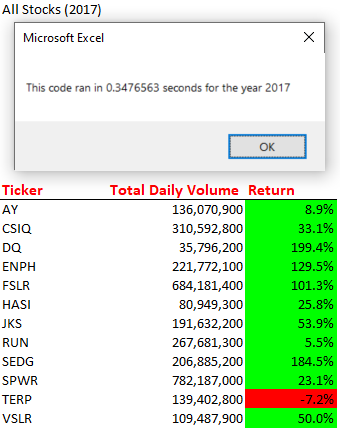
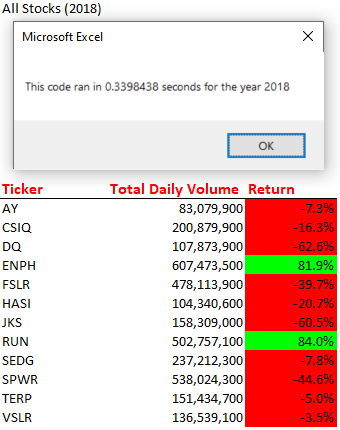

# Stocks Analysis

## Overview of Project
---
Steve has just graduated with his finance degree and his parents have decided to be his first clients. Steve's parents are new to investments plans and have not done much research on stocks. They are passionate about green energy and have decided to invest all of their money into DAQO, a company who makes parts needed for solar panels. Steve has agreed to look into DAQO stocks but is interested in diversifying his parent's portfolio. He plans to analyze a handfull of green energy stocks in addition to DAQO's stock. Steve has collected this data and has enlisted my assistance to help him run the numbers.

## Objective
---
My goal when analyzing this data was to create an easy to digest output format that Steve could review quickly to make solid investing decisions as efficiently as possible. As Steve has just graduated with his finance degree, his goals are to try to bring in as many new clients as possible and an easy to use stock analysis tool will really help Steve build his client base.

## Results
---
After reviewing the dataset i was able to create an excel tool that will meet steve's needs while working with his parents as well as with future clients. After writing a program to run the analysis on the 12 stocks that Steve had provided me originally, I knew there was a more efficient way to give steve a tool that could run analysis with other clients who may be interested in a more diverse range of investment options.

## Report Output Examples
---
 ### Example of the 12 stocks Steve provided us for 2017.
 

 ### Example of the 12 stocks Steve provided us for 2018.
 

## Refactoring
---

There is a detailed statement on the advantages and disadvantages of refactoring code in general 3 pt
There is a detailed statement on the advantages and disadvantages of the original and refactored VBA script 3 pt