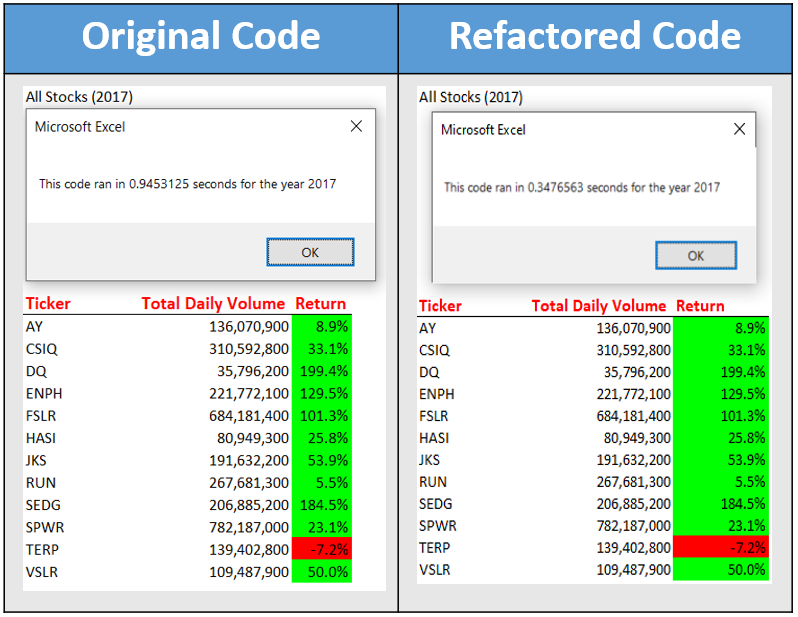

# Stocks Analysis

## Overview of Project
---
After Steve graduated with his finance degree, his parents wanted to be his first clients. Being interested in green energy, Steve's parents were highly interested in companies that were alligned with their interests; specifcally DAQO a company who makes parts needed to manufacture solar panels. Steve enlisted my help to build a tool that would review stock data over the last few years and help him make the best decision for his parents investement. After presenting Steve with our initial tool, he is very satisfied with what he has so far, but given the results of the data Steve would like to expand his dataset to include the entire stock market over the past few years. 

## Objective
---
While my code worked well on Steve's initial list of stocks, it may not work well for whole stock market research. Understanding Steve's new objective I decided to refactor my original code to be used on a much larger data set with the goal of reducing the time it takes to return the same results. 

## Results
---
In the end, i was able to create a new tool for Steve's needs. By optimizing the code I was able reduce run times by an estimated 60% all while returning the same results. I've included screenshots to show our results in a reduced timeframe as well as a snip of the code which is doing the bulk of the work, To view the workbook [Click Here](./vba_challenge.xlsm). with this refactored code, Steve will be able to analyze a much larger dataset in a reasonable time to help him make investment decisions for his clients.

### Report Output Examples
---
 Efficiency example of the 12 stocks Steve provided us for 2017.
 
 Efficiency example of the 12 stocks Steve provided us for 2018.
 

### Refactored Code Example
---
Sample of refactored code outlining the enhanced nested loop to increase efficiency.

## Refactoring Q&A
---
1. What are the advantages or disadvantages of refactoring code?
    - Advantages: Refactoring allows the creator an opportunity to reflect on the code written in an effort to organize the structure in an easier to read format as well as enhance their code to be more efficient or more accurate. 
    - Disadvantages:  Depending on the project constraints, refactoring takes additional time that not all projects will be able to afford. The benefits of refactoring may not be great enough to push deadlines, especially if only working with a small data set. 
2. How do these pros and cons apply to refactoring the original VBA script?
    -   Given the nature of Steve's request and expected intent for this tool, I believe the advantages heavily outweigh the disadvantages in refactoring this code. Because Steve wants to expand his dataset to include the entire stock market, the original code could take a significantly longer time to run. By refactoring this code we have created a tool that Steve will be able to use not only with his parents investment but also on additional new clients.

